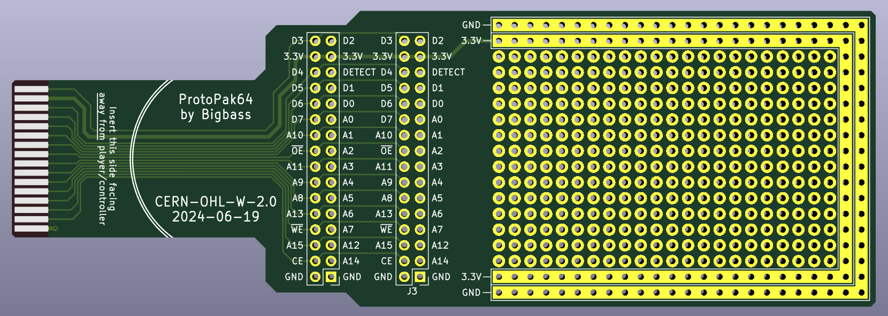
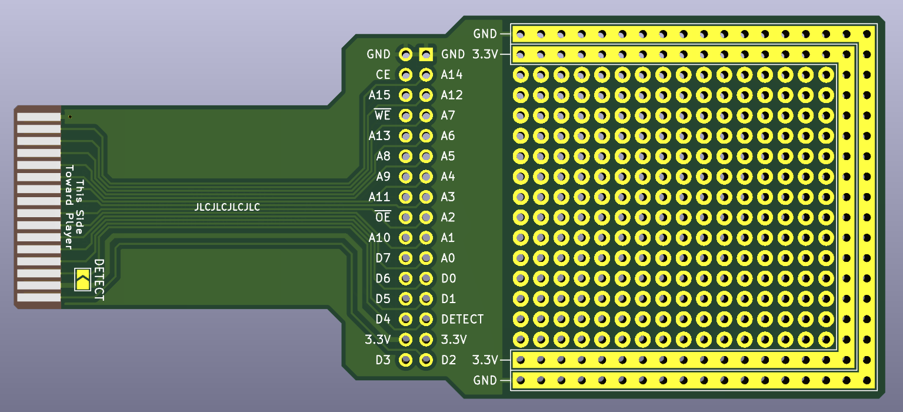

### Description
The ProtoPak64 is a breakout and prototyping PCB for the accessory pak port found on the bottom of N64 controllers.

Latest gerber files can be found in `/hardware/fab/protopak64-2024-06-19.zip`.

### JLCPCB Ordering
Single PCB, 1.2mm thickness, HASL finish (or better), 1oz copper weight, and using a specified location for the order number. PCB Color can be anything. Use default for remaining options.

