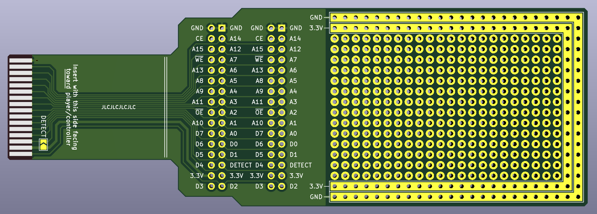

### Description
The ProtoPak64 is a breakout and prototyping PCB for the accessory pak port found on the bottom of N64 controllers.

Latest gerber files can be found in `/hardware/gerbers/`.

### JLCPCB Ordering
Single PCB, 1.2mm thickness, HASL finish, 1oz copper weight, and using a specified location for the order number.

